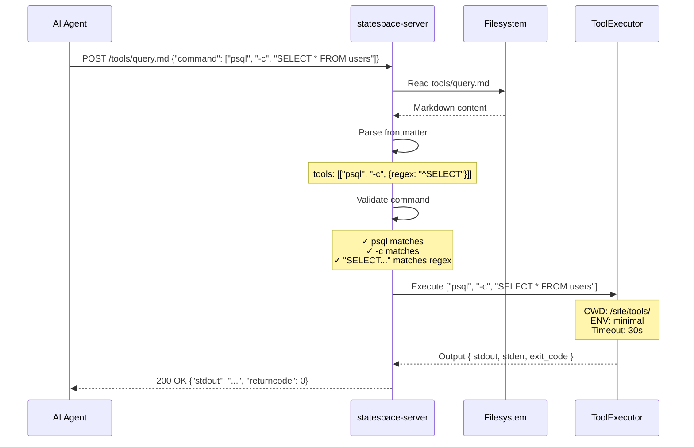

# RFD 001: Statespace Server - Open Source Tool Execution Runtime

| Field | Value |
|-------|-------|
| **State** | Draft |
| **Authors** | antidmg |
| **Created** | 2025-01-02 |
| **Updated** | 2025-01-02 |

## Abstract

This RFD describes `statespace-server`, an open-source Rust library and binary for serving AI tool execution environments. It provides the core functionality of reading markdown files, parsing frontmatter tool specifications, validating commands against those specifications, and executing whitelisted tools in a sandboxed environment.

The library is designed with two deployment modes in mind:

1. **Standalone (OSS)**: Users run `statespace serve <directory>` to host their own tool sites locally or on their infrastructure
2. **Cloud-hosted (Proprietary)**: The `environment-server` binary in the gateway repo uses `statespace-server` as a library, adding cloud features (S3 storage, telemetry, search, billing integration)

This separation allows us to open-source the core execution model while keeping proprietary cloud infrastructure closed.

## Background

### Current State

We have two implementations of tool-serving:

1. **`toolfront serve`** (Python/FastAPI): A simple server that reads markdown files and executes commands defined in YAML/TOML frontmatter. Lives in the `toolfront` repo.

2. **`environment-server`** (Rust/Axum): A full-featured server with S3 storage, search/embeddings, telemetry, rate limiting, gateway sync, and PAT authentication. Lives in the `gateway` repo (proprietary).

The Python implementation is what open-source users run. The Rust implementation is what our cloud offering uses. They share the same protocol (frontmatter format, HTTP API) but the implementations are entirely separate.

### Problems

1. **Duplicated logic**: Frontmatter parsing, command validation, and tool execution are implemented twice (Python and Rust)
2. **Feature drift**: The Python version lacks security features present in Rust (SSRF protection, path traversal validation, env isolation)
3. **No shared testing**: Protocol compatibility is not enforced by shared tests
4. **Python performance**: For larger tool sites, Python's subprocess handling is slower than Rust
5. **Deployment complexity**: Python requires runtime dependencies; Rust produces a single static binary

### The Statespace Rename

The `toolfront` project is being renamed to `statespace`. This RFD is part of that transition, introducing the Rust core under the new name.

## Requirements

### Must Have

1. **Feature parity with `toolfront serve`**:
   - Serve markdown files from a local directory
   - Parse YAML and TOML frontmatter
   - Validate commands against `tools:` specifications
   - Execute allowed commands as subprocesses
   - Return stdout/stderr/exit code as JSON

2. **Security features from `environment-server`**:
   - Path traversal prevention (reject `..` and absolute paths)
   - Environment isolation (clear env vars, minimal PATH)
   - Output size limits (prevent DoS via large output)
   - Execution timeouts

3. **Reusable as library**: `environment-server` can import and extend it

4. **Single static binary**: No runtime dependencies for standalone mode

5. **Cross-platform**: Linux, macOS, (best-effort Windows)

### Nice to Have

1. **HTTP client tool**: Sandboxed curl equivalent with SSRF protections
2. **Glob tool**: Fast file listing without subprocess
3. **Config file support**: Override limits, port, host via TOML config
4. **Graceful shutdown**: Handle SIGTERM for container deployments

### Non-Goals

1. **S3/cloud storage**: Proprietary feature for environment-server
2. **Search/embeddings**: Proprietary feature (uses DuckDB, vector stores)
3. **Request tracing/telemetry**: Proprietary feature (Parquet, OpenTelemetry)
4. **Authentication**: Proprietary feature (PAT tokens, gateway sync)
5. **Rate limiting**: Proprietary feature (per-token limits)
6. **Python compatibility layer**: The OSS binary replaces the Python version

## Design

### Architecture

```
┌─────────────────────────────────────────────────────────────────────┐
│                         toolfront repo (OSS)                        │
├─────────────────────────────────────────────────────────────────────┤
│                                                                     │
│  ┌─────────────────────────────────────────────────────────────┐   │
│  │                    core/ (Rust workspace)                    │   │
│  ├─────────────────────────────────────────────────────────────┤   │
│  │                                                              │   │
│  │  ┌────────────────────────────────────────────────────────┐ │   │
│  │  │              statespace-server (library)               │ │   │
│  │  ├────────────────────────────────────────────────────────┤ │   │
│  │  │  - Axum router (GET/POST handlers)                     │ │   │
│  │  │  - ContentResolver (local filesystem)                  │ │   │
│  │  │  - Frontmatter parsing (YAML/TOML)                     │ │   │
│  │  │  - Tool validation (spec matching)                     │ │   │
│  │  │  - ToolExecutor (subprocess, glob, curl)               │ │   │
│  │  │  - Security (path validation, env isolation)           │ │   │
│  │  └────────────────────────────────────────────────────────┘ │   │
│  │                              │                               │   │
│  │  ┌────────────────────────────────────────────────────────┐ │   │
│  │  │              statespace (binary)                       │ │   │
│  │  ├────────────────────────────────────────────────────────┤ │   │
│  │  │  - CLI: statespace serve <dir> [--port] [--host]       │ │   │
│  │  │  - Uses statespace-server library                      │ │   │
│  │  └────────────────────────────────────────────────────────┘ │   │
│  │                                                              │   │
│  └──────────────────────────────────────────────────────────────┘   │
│                                                                     │
│  src/toolfront/ (Python - existing, unchanged for now)              │
│                                                                     │
└─────────────────────────────────────────────────────────────────────┘

┌─────────────────────────────────────────────────────────────────────┐
│                       gateway repo (Proprietary)                    │
├─────────────────────────────────────────────────────────────────────┤
│                                                                     │
│  ┌────────────────────────────────────────────────────────────────┐ │
│  │                    environment-server                          │ │
│  ├────────────────────────────────────────────────────────────────┤ │
│  │  - Uses statespace-server as git dependency                    │ │
│  │  - Adds: S3 storage, search, telemetry, auth, rate limiting   │ │
│  │  - Adds: Gateway sync, PAT validation, audit logging          │ │
│  └────────────────────────────────────────────────────────────────┘ │
│                                                                     │
└─────────────────────────────────────────────────────────────────────┘
```

### Module Structure

```
core/
├── Cargo.toml                    # Workspace manifest
├── crates/
│   └── statespace-server/
│       ├── Cargo.toml
│       └── src/
│           ├── lib.rs            # Public API
│           ├── server.rs         # Axum router builder
│           ├── content.rs        # ContentResolver (local FS)
│           ├── frontmatter.rs    # YAML/TOML parsing
│           ├── validation.rs     # Tool spec validation
│           ├── executor.rs       # ToolExecutor
│           ├── tools.rs          # BuiltinTool enum (exec, glob, curl)
│           ├── security.rs       # Path validation, SSRF protection
│           ├── protocol.rs       # ActionRequest/ActionResponse
│           └── error.rs          # Error types
└── src/
    └── main.rs                   # CLI binary
```

### Core Types

```rust
/// Configuration for the server
pub struct ServerConfig {
    /// Root directory for content
    pub content_root: PathBuf,
    /// Host to bind to (default: 127.0.0.1)
    pub host: String,
    /// Port to bind to (default: 8000)
    pub port: u16,
    /// Execution limits
    pub limits: ExecutionLimits,
}

/// Execution limits for tools
pub struct ExecutionLimits {
    /// Maximum output size in bytes (default: 1MB)
    pub max_output_bytes: usize,
    /// Maximum items in glob results (default: 1000)
    pub max_list_items: usize,
    /// Execution timeout (default: 30s)
    pub timeout: Duration,
}

/// Frontmatter extracted from markdown files
pub struct Frontmatter {
    /// Tool specifications
    pub specs: Vec<ToolSpec>,
}

/// A tool specification from frontmatter
pub enum ToolSpec {
    /// Simple: ["ls", "{path}"]
    Simple { parts: Vec<ToolPart> },
    /// With options control: ["cat", "{}", ";"]
    Locked { parts: Vec<ToolPart> },
}

/// A part of a tool specification
pub enum ToolPart {
    /// Literal string that must match exactly
    Literal(String),
    /// Placeholder that matches any value
    Placeholder,
    /// Regex constraint
    Regex(Regex),
}

/// Request to execute a tool
pub struct ActionRequest {
    pub command: Vec<String>,
    pub env: Option<HashMap<String, String>>,
}

/// Response from tool execution
pub struct ActionResponse {
    pub stdout: String,
    pub stderr: String,
    pub returncode: i32,
}
```

### HTTP API

The server exposes two endpoints on every path:

#### GET `/{path}`

Read a markdown file. Resolution order:

1. If path exists as file → serve it
2. If path is directory → serve `{path}/README.md`
3. If path doesn't exist → try `{path}.md`
4. Otherwise → 404

Response: Raw markdown content (text/plain or text/markdown)

#### POST `/{path}`

Execute a tool defined in the file's frontmatter.

Request body:
```json
{
  "command": ["ls", "-la", "docs/"],
  "env": {"MY_VAR": "value"}  // optional
}
```

Validation:
1. Resolve file path (same as GET)
2. Parse frontmatter
3. Validate command against `tools:` specs
4. If valid, execute tool
5. Return result

Response:
```json
{
  "stdout": "...",
  "stderr": "...",
  "returncode": 0
}
```

Error responses use appropriate HTTP status codes:
- 400: Invalid command format
- 403: Command not allowed / path traversal
- 404: File not found
- 408: Execution timeout
- 413: Output too large
- 500: Execution failed

### Frontmatter Format

Supports both YAML and TOML:

```yaml
---
tools:
  - [ls]                           # Allow ls with any args
  - [cat, {}]                      # cat with one placeholder arg
  - [cat, {}, ";"]                 # cat with one arg, no extra args allowed
  - [psql, -c, {regex: "^SELECT"}] # Regex-constrained arg
---
```

```toml
+++
tools = [
  ["ls"],
  ["cat", {}],
  ["cat", {}, ";"],
]
+++
```

### Security Model

#### Path Traversal Prevention

```rust
fn validate_path(content_root: &Path, requested: &str) -> Result<PathBuf> {
    // Reject absolute paths
    if requested.starts_with('/') {
        return Err(Error::PathTraversal);
    }
    
    // Reject .. components
    if requested.contains("..") {
        return Err(Error::PathTraversal);
    }
    
    // Resolve and verify within content_root
    let resolved = content_root.join(requested).canonicalize()?;
    if !resolved.starts_with(content_root) {
        return Err(Error::PathTraversal);
    }
    
    Ok(resolved)
}
```

#### Environment Isolation

Subprocesses run with:
- Cleared environment (no inherited secrets)
- Minimal PATH: `/usr/local/bin:/usr/bin:/bin`
- HOME set to `/tmp`
- CWD set to the markdown file's parent directory

```rust
Command::new(command)
    .args(args)
    .current_dir(&file_parent)
    .env_clear()
    .env("PATH", "/usr/local/bin:/usr/bin:/bin")
    .env("HOME", "/tmp")
    .env("LANG", "C.UTF-8")
```

#### SSRF Protection (for curl tool)

When the optional HTTP client tool is enabled:
- Only http:// and https:// schemes
- Block localhost, 127.0.0.1, ::1
- Block private IP ranges (RFC1918, link-local)
- Block cloud metadata endpoints (169.254.169.254)
- Disable redirects (prevent redirect-based SSRF)
- DNS resolution validates IPs before request

### Extension Points

The library is designed to be extended by `environment-server`:

```rust
/// The core server builder
pub struct ServerBuilder {
    config: ServerConfig,
    content_resolver: Box<dyn ContentResolver>,
    tool_executor: Box<dyn ToolExecutor>,
    middleware: Vec<BoxedMiddleware>,
}

impl ServerBuilder {
    /// Use default local filesystem resolver
    pub fn with_local_fs(mut self, root: PathBuf) -> Self;
    
    /// Use custom content resolver (e.g., S3)
    pub fn with_content_resolver(mut self, resolver: impl ContentResolver) -> Self;
    
    /// Use custom tool executor
    pub fn with_tool_executor(mut self, executor: impl ToolExecutor) -> Self;
    
    /// Add middleware layer
    pub fn with_middleware<M: Middleware>(mut self, middleware: M) -> Self;
    
    /// Build the Axum router
    pub fn build(self) -> Router;
}
```

This allows `environment-server` to:
- Replace `LocalContentResolver` with `S3ContentResolver`
- Add authentication middleware
- Add tracing middleware
- Add rate limiting middleware

### CLI Interface

```
statespace serve <DIRECTORY> [OPTIONS]

Arguments:
  <DIRECTORY>  Path to the tool site directory (must contain README.md)

Options:
  -h, --host <HOST>      Host to bind to [default: 127.0.0.1]
  -p, --port <PORT>      Port to bind to [default: 8000]
  -c, --config <FILE>    Config file (TOML)
      --timeout <SECS>   Execution timeout in seconds [default: 30]
      --help             Print help
      --version          Print version
```

### Sequence Diagram: Tool Execution



## Implementation Plan

### Phase 1: Core Library (This PR)

1. Set up Rust workspace in `toolfront/core/`
2. Implement core types: `Frontmatter`, `ToolSpec`, `ActionRequest/Response`
3. Implement frontmatter parsing (port from gateway `tools` crate)
4. Implement validation logic (port from gateway `tools` crate)
5. Implement `ToolExecutor` (simplified from gateway)
6. Implement `LocalContentResolver`
7. Build Axum router
8. Add CLI binary

### Phase 2: Integration with environment-server

1. Add `statespace-server` as git dependency in gateway
2. Refactor `environment-server` to use shared types
3. Implement `S3ContentResolver` in gateway (wraps `statespace-server` traits)
4. Add gateway-specific middleware

### Phase 3: Deprecate Python Implementation

1. Update documentation to recommend Rust binary
2. Add migration guide
3. Eventually remove Python `toolfront serve`

## Alternatives Considered

### 1. Keep Python, Don't Unify

Continue maintaining separate Python and Rust implementations.

**Problems**:
- Permanent feature drift
- Duplicate bug fixes
- No shared security improvements
- Python performance limits

### 2. Rewrite Python to Call Rust via FFI

Use PyO3 to expose Rust logic to Python.

**Problems**:
- Adds complexity (FFI boundary)
- Still need Python runtime
- Harder to debug
- Distribution becomes more complex

### 3. Open-Source Entire Gateway Crates

Publish `tools`, `content-fs` as separate crates.

**Problems**:
- These crates have gateway-specific code mixed in
- Would need significant refactoring
- Version coordination complexity
- Exposes internal implementation details

### 4. Create Shared Crates Published to crates.io

Publish `statespace-server` to crates.io.

**Considered for future**:
- Adds maintenance burden (semver, releases)
- Git dependency is simpler for now
- Can publish later if there's demand

## Future Work

1. **crates.io publication**: If there's community interest
2. **WebAssembly target**: Run in browser for local-only tool sites
3. **Plugin system**: Allow custom tool implementations
4. **MCP support**: Model Context Protocol integration
5. **Watch mode**: Auto-reload on file changes

## References

- [Statespace Protocol Spec](https://statespace.dev/docs/protocol) (to be written)
- [Gateway environment-server](../../../gateway/binaries/environment-server/)
- [Current Python implementation](../../src/toolfront/cli/serve.py)
- [Axum web framework](https://github.com/tokio-rs/axum)
- [Oxide's Omicron patterns](https://github.com/oxidecomputer/omicron)
