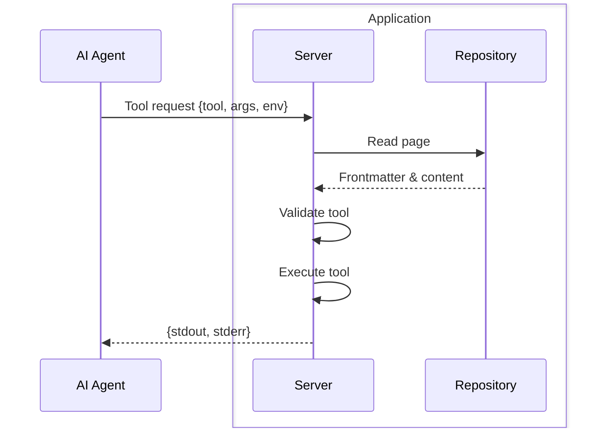

# Architecture

Applications expose agent tools over HTTP.

## Tool Call Flow

```mermaid
sequenceDiagram
    participant AI Agent
    box Application
        participant Server
        participant Repository
    end

    AI Agent->>Server: Tool request {tool, args, env}
    Server->>Repository: Read page
    Repository-->>Server: Frontmatter & content
    Server->>Server: Validate tool
    Server->>Server: Execute tool
    Server-->>AI Agent: {stdout, stderr}
```