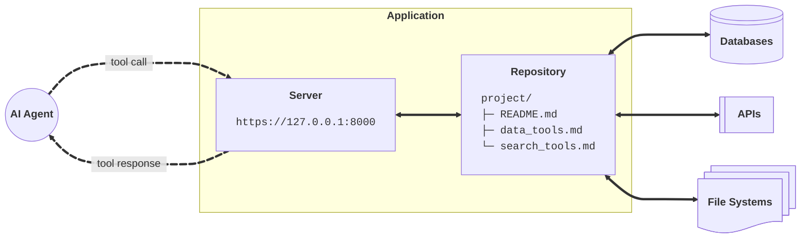

# Overview

ToolFront applications serve Markdown tools over HTTP.

```mermaid
graph LR
    Agent(("<b>AI Agent</b>")) e1@===>| &nbsp; tool call &nbsp; | Server
    Server e2@===>| &nbsp; tool response &nbsp; | Agent

    subgraph App["<b>Application</b>"]
        Server["<b>Server</b><br/><pre style='font-family:monospace'>https://127.0.0.1:8000</pre>"] e3@ <===> Repository["<b>Repository</b></br><pre style='text-align:left; font-family:monospace'>project/
├─ README.md
├─ data_tools.md
└─ search_tools.md</pre>"]
    end

    Repository <===> API@{ shape: lin-cyl, label: "<b>Databases</b>" }
    Repository <===> Database@{ shape: lin-rect, label: "<b>APIs</b>" }
    Repository <===> FileSystem@{ shape: docs, label: "<b>File Systems</b>" }

    e1@{ animation: slow }
    e2@{ animation: slow }
```