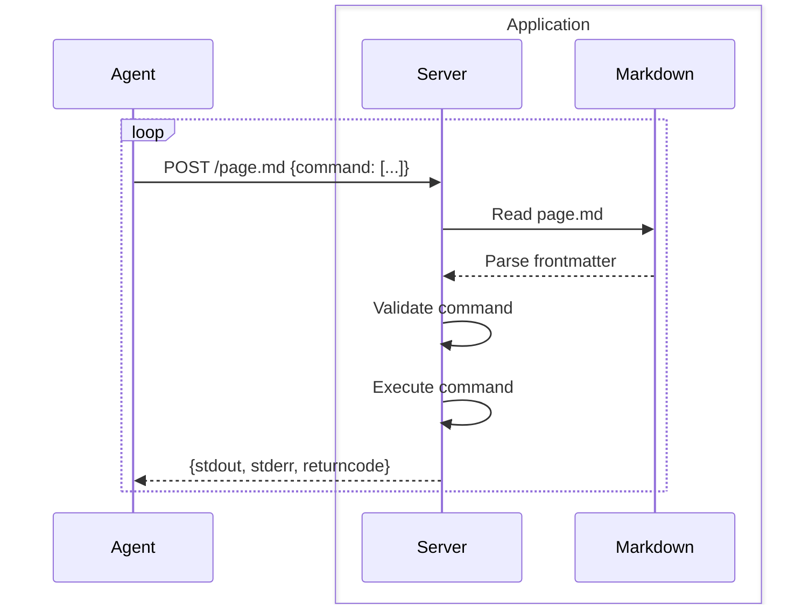

# Architecture

ToolFront applications expose Markdown-defined tools to AI agents over HTTP.

## Core Components

**AI agents** make HTTP tool requests to the **app server**, which validates them against the **Markdown repository** specs, executes them (optionally accessing **external resources**), and returns the results.


**AI Agent**
: Agent running through the [SDK](../integration/python_sdk.md), [MCP](../integration/mcp.md), or [CLI](../../reference/client_library/cli_commands.md) client that sends tool requests to the server

**App Server**
: Server that validates the AI agent's tool requests against the repository's Markdown specs

**Markdown Repository**
: Directory of [Markdown files](markdown.md) with YAML frontmatters defining [tools](tools.md), plus any additional files

**External Resources**
: Third-party databases, APIs, and file systems accessed via tools


## AI Agent Flow

Agents operate by making repeated POST requests to execute tools as needed.



**Steps:**

1. **Agent sends command** - POST request with command array to `.md` endpoint
2. **Server reads file** - Loads Markdown and parses frontmatter
3. **Validate command** - Checks against tool specs (base match, regex, `--` marker)
4. **Execute command** - Runs validated command with environment variables
5. **Return results** - Sends stdout/stderr/returncode to agent

## Command Validation

Tool commands are validated against three checks.

**1. Base Command Match**
: Command must start with tool's base (e.g., `["ls", "-l"]` matches `[ls]`)

**2. Placeholder Validation**
: `{{ }}` accepts any argument, `{{ "regex" }}` validates against pattern

**3. Options Control**
: Additional flags and arguments disabled if `--` marker present

**Example validation:**

```yaml
tools:
  - [cat, {{ ".*\.txt$" }}, --]
```

- ✅ `["cat", "data.txt"]` - Matches base, passes regex
- ❌ `["cat", "data.py"]` - Fails regex constraint (not .txt file)
- ❌ `["cat", "data.txt", "-n"]` - Additional flags disabled by `--`

## Security Model

ToolFront uses multiple layers of protection to prevent malicious execution and keep your data safe

**Command Whitelisting**
: Only tools in frontmatter can execute, no arbitrary commands

**No Shell Execution**
: Commands run directly, not through shell

**Directory Isolation**
: Commands execute in file's parent directory, paths validated against base

**Environment Injection**
: Environment `$VARIABLES` replaced server-side, never exposed to agents

**Execution Timeout**
: Commands timeout after 30 seconds to prevent hanging
