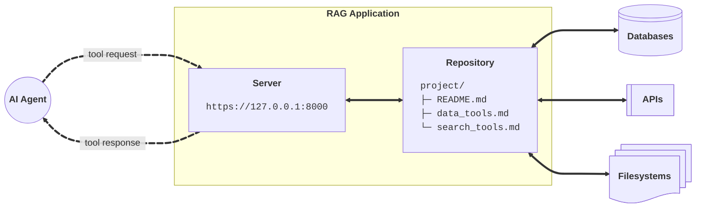
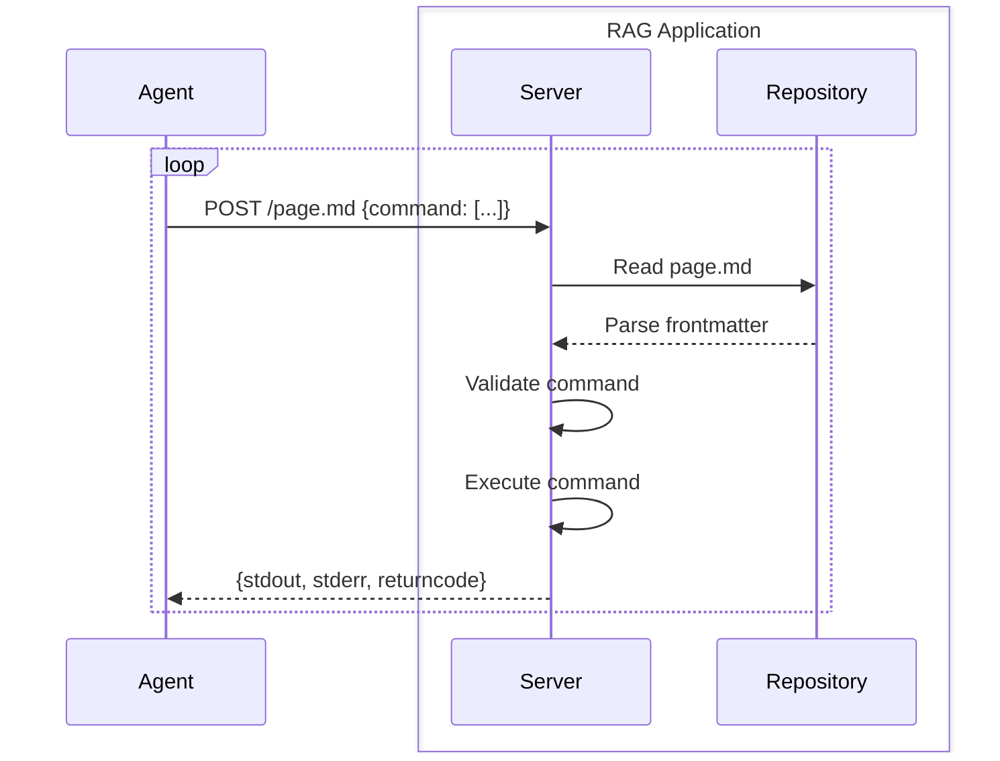

# Architecture

RAG applications serve tools over HTTP.

## Core components

**AI agents** make HTTP tool requests to the **RAG server**, which validates them against the **Markdown repository**, executes them on **external resources**, and returns the results.




**AI agent**
: Agent running through the [SDK](../integration/python_sdk.md), [MCP](../integration/mcp.md), or [CLI](../../reference/client_library/cli_commands.md) client that sends tool requests to the server

**RAG server**
: Server that validates the AI agent's tool requests against the repository's Markdown specs

**Markdown repository**
: Directory of [Markdown files](markdown.md) with YAML frontmatters defining [tools](tools.md), plus any additional files

**External resources**
: Third-party databases, APIs, and file systems accessed via tools

## Tool execution

### AI agent flow

Agents execute tools by making POST requests to the RAG application.



**Steps:**

1. **Agent sends command** - POST request with command array to `.md` endpoint
2. **Server reads file** - Loads Markdown and parses frontmatter
3. **Validate command** - Checks against tool specs (base match, regex, `--` marker)
4. **Execute command** - Runs validated command with environment variables
5. **Return results** - Sends stdout/stderr/returncode to agent

### REST API

The API uses path-based endpoints to execute tools directly against your Markdown repository.

**GET /{path}** - Fetch markdown files and resources from the application

```bash
curl -X GET https://your-app.toolfront.app/README.md
```

> Returns the raw file content

**POST /{path}** - Execute a tool defined in the file's frontmatter

```bash
curl -X POST https://your-app.toolfront.app/README.md \
  -H "Content-Type: application/json" \
  -d '{
    "command": ["ls", "-la"],
    "env": {"API_KEY": "secret"}
  }'
```

> Returns the tool execution output

!!! question "Learn more"
    See the [server API reference](../../reference/application/server_api/) for complete command syntax and options.

### Path resolution

The server resolves paths using three lookup strategies for both GET and POST requests.

**1. Strict lookup** - Exact path to a Markdown file with extension
```bash
curl -X GET https://your-app.toolfront.ai/file.md
```

**2. Implicit extension** - Path without `.md` extension automatically appends it

```bash
curl -X POST https://your-app.toolfront.ai/path/file
```
> Maps to `path/file.md`


**3. Directory default** - Directory path `/` defaults to `README.md` in that directory
```bash
curl -X GET https://your-app.toolfront.ai/path/
```
> Maps to `path/README.md`

## Security

### Command validation

Tool commands are validated against three checks.

**1. Base Command Match**
: Command must start with tool's base (e.g., `["ls", "-l"]` matches `[ls]`)

**2. Placeholder Validation**
: `{ }` accepts any argument, `{ regex: ... }` validates them against pattern

**3. Options Control**
: Additional flags and arguments disabled if `;` marker present

**Example validation:**

```yaml
tools:
  - [cat, { regex: ".*\.txt$" }, ;]
```

- ✅ `["cat", "data.txt"]` - Matches base, passes regex
- ❌ `["cat", "data.py"]` - Fails regex constraint (not `.txt` file)
- ❌ `["cat", "data.txt", "-n"]` - Additional flags disabled by `;`

### Security model

ToolFront uses multiple layers of protection to prevent malicious execution and keep your data safe

**Command Whitelisting**
: Only tools in frontmatter can execute, no arbitrary commands

**No Shell Execution**
: Commands run directly, not through shell

**Directory Isolation**
: Commands execute in file's parent directory, paths validated against base

**Environment Injection**
: Environment `$VARIABLES` replaced server-side, never exposed to agents

**Execution Timeout**
: Commands timeout after 30 seconds to prevent hanging
