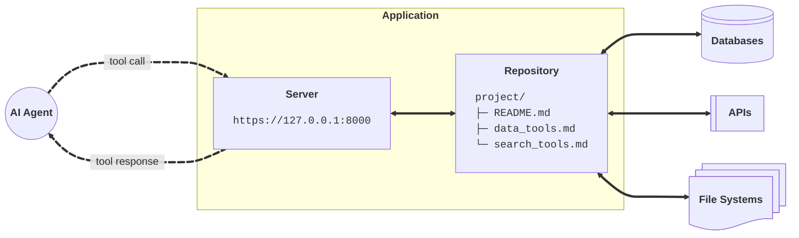
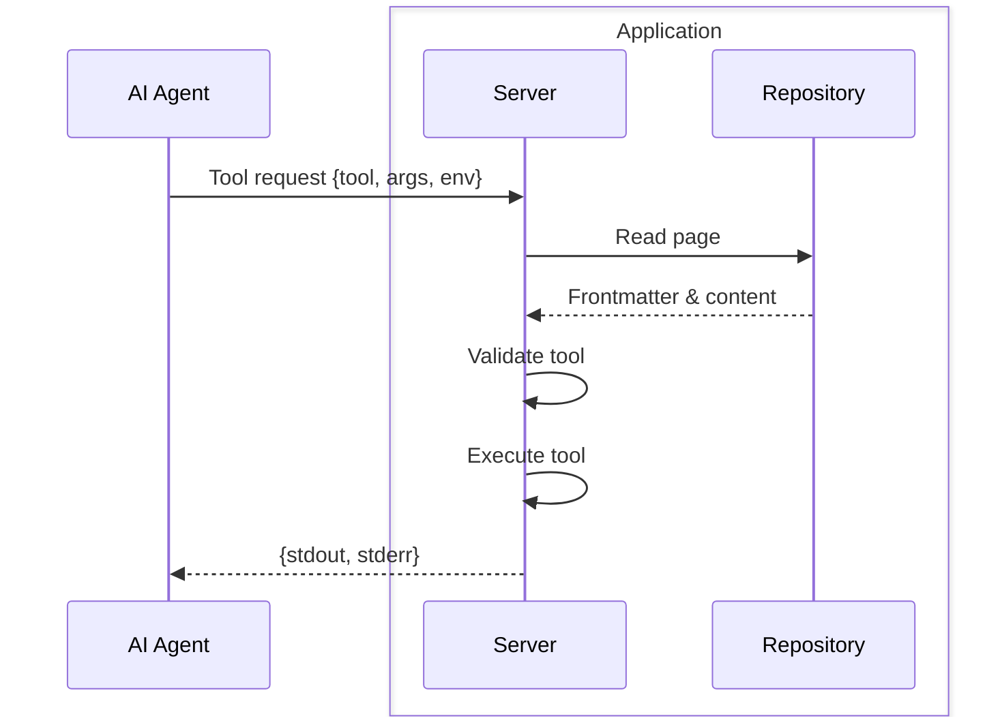

# Applications

ToolFront applications serve Markdown tools over HTTP.




---

## Markdowns

### Instructions

Add agent instructions to Markdown files.

```markdown title="README.md" hl_lines="8-12"
---
tools:
  - [ls]
  - [cat]

---

You are a helpful assistant.

## Guidelines
- Answer the user's question without making assumptions
- Use `ls` to explore available files, then `cat` to read them
```

### Tools

Declare executable tools in YAML frontmatters.

```markdown title="data_tools.md" hl_lines="1-9"
---
tools:
  - [grep]
  - [tree]
  - [psql, -U, $USER, -d, $DATABASE, -c, {query}]
  - [curl, -X, GET, "https://api.example.com/{endpoint}"]
  - [python3, scripts/analyze.py, --format, {format}]

---

## Guidelines
- Use `grep`, and `tree` to explore the project's files.
- Use `psql` to query the PostgreSQL database.
- Use `curl` to interact with external APIs.
- Use the `analyze.py` script to analyzes data.
```

### Progressive Disclosure

Agents can only call tools they've discovered in Markdown files, for example:

<div class="grid" markdown>

```bash
project/
├── README.md
├── src/
│   ├── data_tools.md
│   └── etl_tools.md
└── data/

2 directories, 5 files
```

1. Agent calls `ls` on `README.md`
2. Agent discovers `data_tools.md` file
3. Agent calls `cat` on `data_tools.md`
4. Agent discovers `psql` tool
5. Agent calls `psql` on `data_tools.md`

</div>


!!! info "Tools Are All You Need"
    Use navigation tools like `ls`, `cat`, `grep`, `tree`, and `curl` to discover new instructions and tools

---

## HTTP Server

### Serve Locally

Run local apps on your machine.

```bash
toolfront serve ./repo
# Returns: http://127.0.0.1:8000
```

### Deploy to Cloud

Deploy apps to the community cloud or privately.

```bash
toolfront deploy ./repo
# Returns: https://fte499.toolfront.app
```

### Tool Call Flow



---

## Agent Integration

### Python SDK

Interact with applications in Python. See [Python SDK Guide](../guides/python_sdk.md).

```python
from toolfront import Application

app = Application(url="http://127.0.0.1:8000")

result = app.ask("Is product XYZ in stock?", model="openai:gpt-5")
```

### MCP Server

Connect MCP-enabled agents to your apps. See [MCP Server Guide](../guides/mcp_server.md).

```json
{
  "mcpServers": {
    "store": {
      "command": "uvx",
      "args": ["toolfront", "mcp", "http://127.0.0.1:8000"]
    }
  }
}
```

### Command Line

Run agents from the terminal. See [CLI Guide](../guides/cli.md).

```bash
toolfront ask http://127.0.0.1:8000 "Is product XYZ in stock?" --model "openai:gpt-5"
```

---


## Security

### Environment Variables

The `$ENVIRONMENT_VARIABLE` syntax passes secrets to tools without exposing them to agents.

```markdown
---
tools:
  - [psql, -U, $USER, -d, $DATABASE, -c, {query}]
---
```

### Parameter Substitution

The `{placeholder}` syntax lets agents pass dynamic values while restricting command structure.

```markdown
---
tools:
  - [curl, -X, GET, "https://api.example.com/{endpoint}"]
---
```

### Additional Parameters

Tools can accept multiple parameters for flexible command execution.

```markdown
---
tools:
  - [python3, scripts/analyze.py, --input, {file}, --format, {format}]
---
```

!!! info "Learning Tools"
    Agents can learn how to use most command-line tools by passing the `--help` flag.