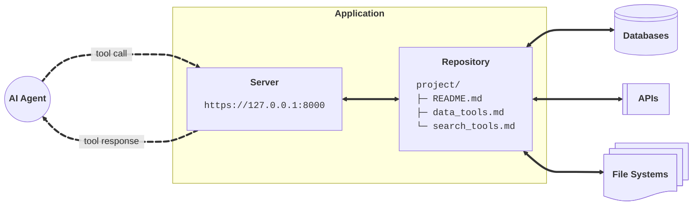
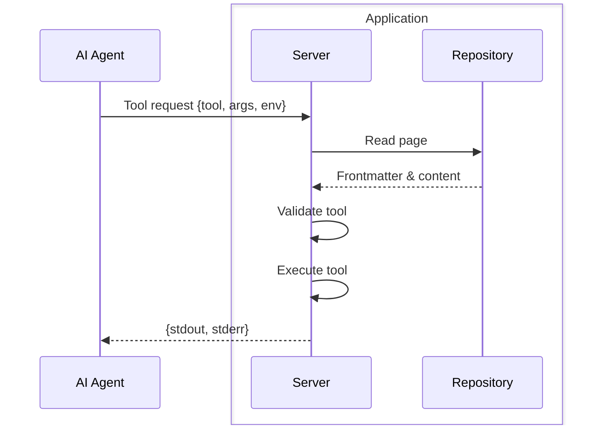

# Overview

ToolFront applications serve Markdown tools over HTTP.




---

## Applications

### Markdowns

#### Instructions

Add agent instructions to Markdown files.

```markdown title="README.md" hl_lines="8-14"
---
tools:
  - [ls]
  - [cat]

---

# Instructions

You are a helpful assistant.

## Guidelines
- Answer the user's question without making assumptions
- Use `ls` to explore available files, then `cat` to read them
```

#### Tools

Declare executable tools in YAML frontmatters.

```markdown title="data_tools.md" hl_lines="1-9"
---
tools:
  - [grep]
  - [tree]
  - [psql, -U, $USER, -d, $DATABASE, -c, {query}]
  - [curl, -X, GET, "https://api.example.com/{endpoint}"]
  - [python3, scripts/analyze.py, --format, {format}]

---

# Tool Instructions

Use `grep`, and `tree` to explore the project's files.
Use `psql` to query the PostgreSQL database.
Use `curl` to interact with external APIs.
Use the `analyze.py` script to analyzes data.
```

#### Progressive Disclosure

Organize files any way you like. Agents can only call tools declared in Markdown files they've read.

```
project/
├── README.md
├── src/
│   ├── data_tools.md
│   └── etl_tools.md
└── data/
```

The agent explores to discover specialized tools:

1. Agent sees `README.md`.
2. Agent calls `ls` on `README.md`, sees `data_tools.md`
3. Agent calls `cat` on `data_tools.md`, discovers `psql` tool
4. Agent calls `psql` on `data_tools.md`

!!! info "Tools Are All You Need"
    You only need tools to build AI agents.

    - **Navigation tools** (`ls`, `cat`, `grep`) let agents read files and discover new instructions and tools
    - **Specialized tools** (`psql`, `python`) let agents take specific actions like querying data

---

### HTTP Server

#### Serve Locally

Run local apps on your machine.

```bash
toolfront serve ./repo
# Returns: http://127.0.0.1:8000
```

#### Deploy to Cloud

Deploy apps to the community cloud or privately.

```bash
toolfront deploy ./repo
# Returns: https://fte499.toolfront.app
```

#### Endpoints

<div class="grid" markdown>

<div markdown>

<span style="border: 1px solid #00bb77; border-radius: 8px; padding: 2px 8px; color: #00bb77; font-weight: bold; font-size: 0.85em;">GET</span> **`/{path}`**

Fetch resource files from the repository.

**Path parameters**

`path` <span style="color: #e6695b;">(required)</span>

: Path to resource file in the repository

**Response Attributes**

`content` <span style="color: #888;">(string)</span>

: Raw content of the requested file

</div>

<div markdown>

**Example**
```bash
curl -X GET \
https://fte499.toolfront.app/README.md
```

**Response**
```markdown
---
tools:
  - [ls]
  - [cat]

---

# Instructions
You are a helpful assistant.
```

</div>

</div>

---

<div class="grid" markdown>

<div markdown>

<span style="border: 1px solid #00bb77; border-radius: 8px; padding: 2px 8px; color: #00bb77; font-weight: bold; font-size: 0.85em;">POST</span> **`/{path}`**

Execute a tool declared in the target file's frontmatter and return the its output.

**Path parameters**

`path` <span style="color: #e6695b;">(required)</span>

:   Path to the Markdown file with tool declaration

**Body parameters**

`tool` <span style="color: #e6695b;">(required)</span>

:   Command array matching a tool declaration in the target file's frontmatter

`args` <span style="color: #6791e0;">(optional)</span>

:   Key-value pairs for `{placeholder}` substitution in the tool command

`env` <span style="color: #6791e0;">(optional)</span>

:   Key-value pairs for `$VARIABLE` substitution in the tool command

**Response Attributes**

`stdout` <span style="color: #888;">(string)</span>

: Standard output from the executed tool command

`stderr` <span style="color: #888;">(string)</span>

: Standard error output from the executed tool command

</div>

<div markdown>

**Example**
```bash
curl -X POST \
https://fte499.toolfront.app/README.md \
-H "Content-Type: application/json" \
-d '{
    "tool": ["ls", "."]
}'
```

**Response**
```json
{
  "stdout": "README.md   src   data",
  "stderr": ""
}
```

</div>

</div>

#### Tool Call Flow


---

## Agent Integration

### Python SDK

Interact with applications in Python. See [Python SDK Guide](../guides/python_sdk.md).

```python
from toolfront import Application

app = Application(url="http://127.0.0.1:8000")

result = app.ask("Is product XYZ in stock?", model="openai:gpt-5")
```

### MCP Server

Connect MCP-enabled agents to your apps. See [MCP Server Guide](../guides/mcp_server.md).

```json
{
  "mcpServers": {
    "store": {
      "command": "uvx",
      "args": ["toolfront", "mcp", "http://127.0.0.1:8000"]
    }
  }
}
```

### Command Line

Run agents from the terminal. See [CLI Guide](../guides/cli.md).

```bash
toolfront ask http://127.0.0.1:8000 "Is product XYZ in stock?" --model "openai:gpt-5"
```

---


## Security


Applications enforces tool restrictions at the file level.

### Environment Isolation

The `$ENVIRONMENT_VARIABLE` syntax passes secrets to tools without exposing them to agents.

```markdown
---
tools:
  - [psql, -U, $USER, -d, $DATABASE, -c, {query}]
---
```

Agents see `$USER` and `$DATABASE` as literals while the server injects actual values.

### Parameter Substitution

The `{placeholder}` syntax lets agents pass dynamic values while restricting command structure.

```markdown
---
tools:
  - [curl, -X, GET, "https://api.example.com/{endpoint}"]
---
```

Agents control `{endpoint}` but cannot modify the base URL or HTTP method.

### Additional Parameters

Tools can accept multiple parameters for flexible command execution.

```markdown
---
tools:
  - [python3, scripts/analyze.py, --input, {file}, --format, {format}]
---
```

Agents pass multiple values through the `args` parameter while the command structure stays fixed.


!!! success "What's Next?"
    - Learn how ToolFront [architecture](architecture.md) handles tool validation and execution
    - Explore [App Networks](app_networks.md) for connecting multiple applications